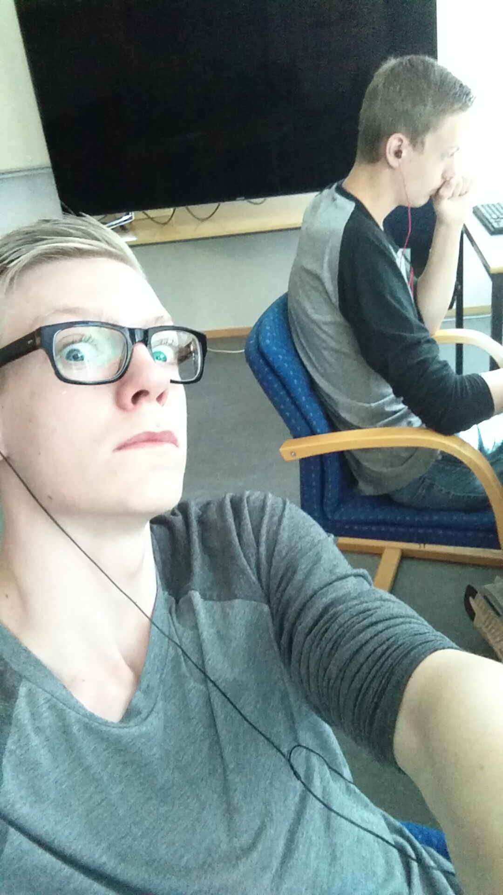

---
titleBreadcrumb: Home
...
My own website made using Anax flat.
===============================

Hello.
This is my first website using Anax flat.

Everything you'll see on this website is my experiment and me testing out the different parts of Anax flat and Markdown.

  A picture of myself.

    
    <h3 style="margin-left: 65px; margin-top: -80px;">Joachim Törnqvist</h3>
    
Hello, my name is, as said above: Joachim Törnqvist. I'm 19 years old currently living in Karlskrona, originally from Tullinge, Stockholm.

